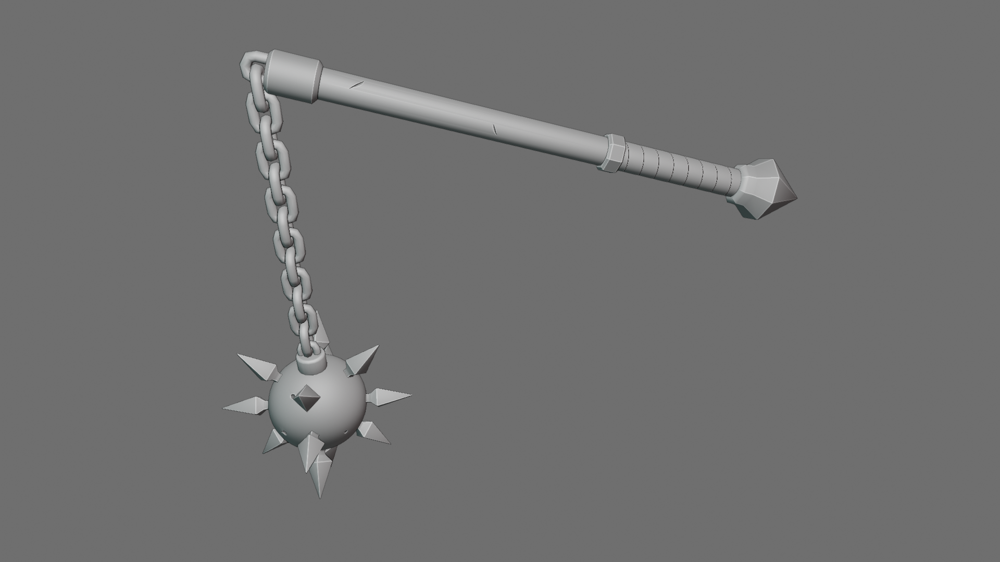
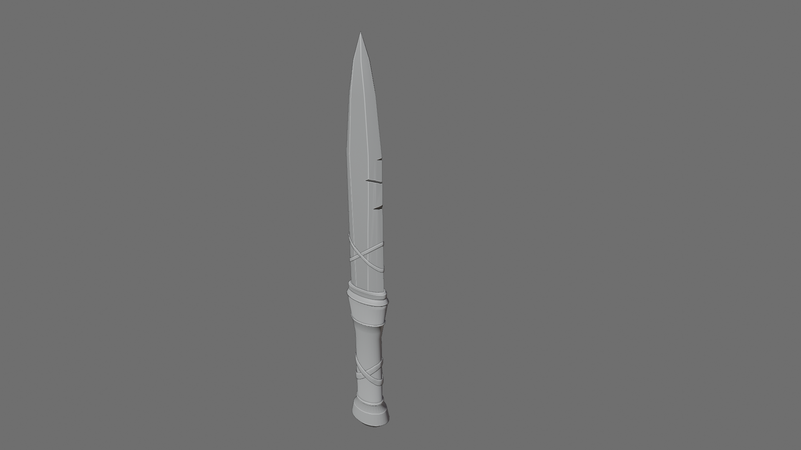
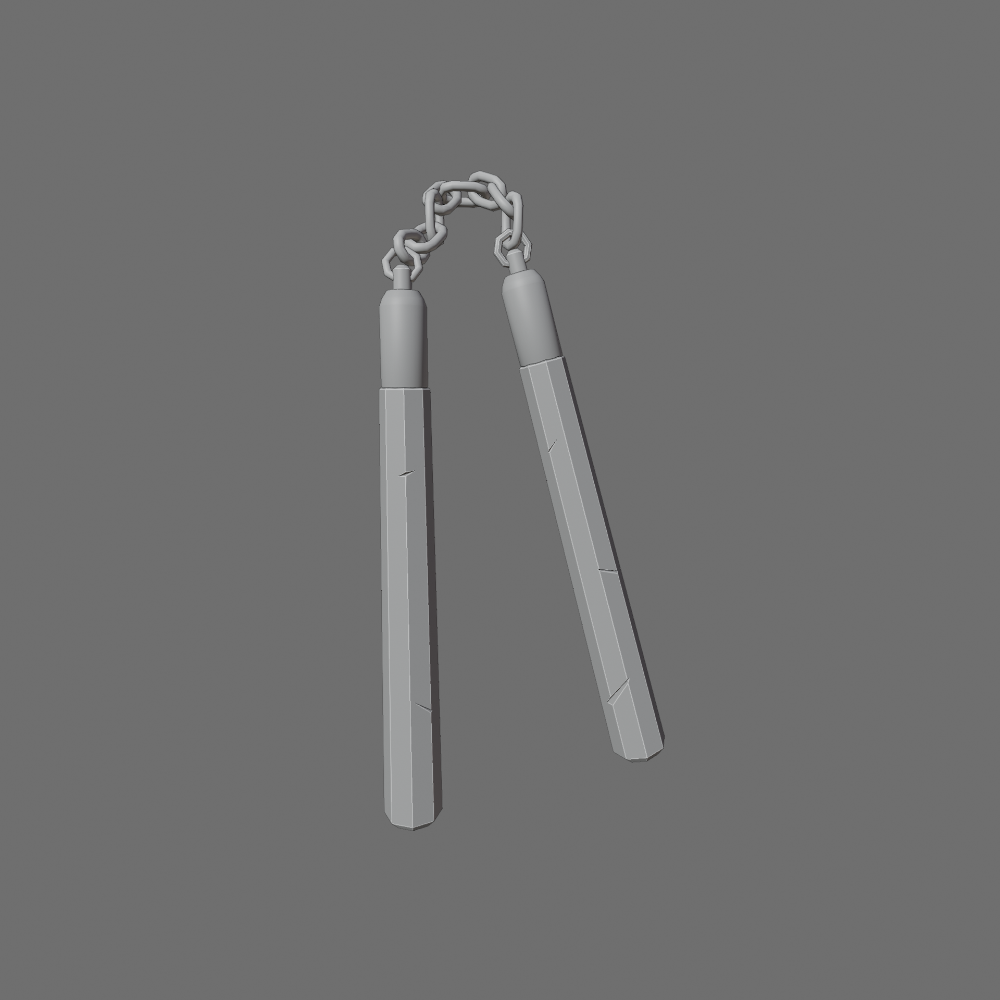
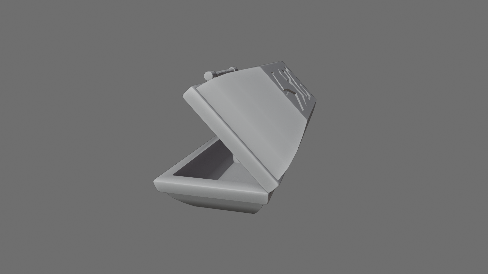

# Coursework for "Blender Fundamentals - Modeling"

This repository contains the assets developed as part of the course [Blender Fundamentals - Modeling](https://www.udemy.com/course/blender-fundamentals-modeling/).

The course was structured in such a way that each lesson taught a single technique. The learner was challenged to use
the technique to create model during the lesson that used the technique. Some challenges built on skills in prior
lessons or on models developed in prior lessons. The course started with a simple 5 star challenge and culminated in
a final challenge to model a mace. Below is a sampling of the different challenge tasks completed:

<table width="100%">
<tbody>
<tr>
<td>
<figure>

</figure> 
</td>
<td>
<figure>

</figure> 
</td>
</tr>
<tr>
<td>
<figure>

</figure> 
</td>
<td>
<figure>

</figure> 
</td>
</tr>
<tr>
<td>
<figure>

</figure> 
</td>
<td>
<figure>

</figure> 
</td>
</tr>
</tbody>
</table>
